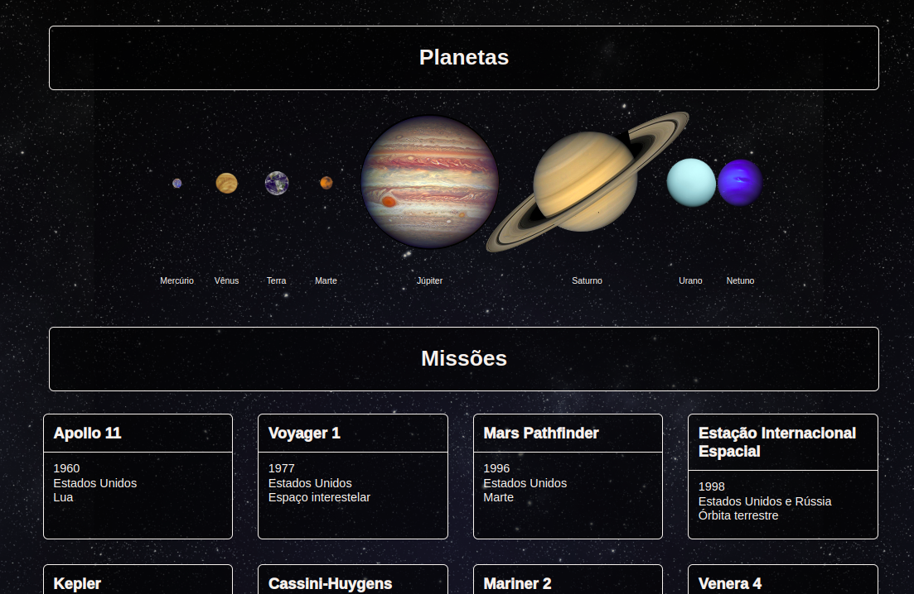

# Solar System Project 🪐

This Project shows the Solar System Planets and cards with information of missions sent from Earth to explore the other planets.

<strong>First commit:</strong> on Apr 6th, 2022.

Here I had to exercise: the usage of JSX in React, create class components in React, use props correctly and use PropTypes, as well as HTML and CSS.

This was my first front-end JavaScript Project, as part of my school [Trybe](https://www.betrybe.com/) requirements to move forward.




# How to run it:

<details>
 <summary><strong> You need to have installed:</strong></summary><br />
 - An Internet Browser <br />

</details>
 

command: `npm install` <br />
command: `npm start` <br />
Open front-end on http://localhost:3000 <br />


# Files/Folders Ownership

Here you find a list of files and or folders according to the ownership.

<details>
 <summary><strong>🙋‍♀️ I coded myself:</strong></summary><br />
   
  ```markdown  
    src/
    App.js
    App.css
    components/

  README.md
  ```
 
 </details>


<details>
 <summary><strong>🧑‍🤝‍🧑 I coded partially - the scholl has coded some of it:</strong></summary><br />
 
 ```markdown   
  src/
    components/
      css/
        PlanetCard.css -> help of same project coded by my teammate Talita Afonso
 ```
 
 </details>


<details>
 <summary><strong>🧛 coded by a teacher or a teammate:</strong></summary><br />
   
 ```markdown  
  none.

  ```
 
 </details>

<details>
 <summary><strong>🏫 coded by the school:</strong></summary><br />
   
  ```markdown  
   all others not mentioned before.
  ```
 
 </details>
 
 #

✨ all icons used here are from:  [EmojiPedia](https://emojipedia.org/). 

#### 🚧 README under construction 🚧
